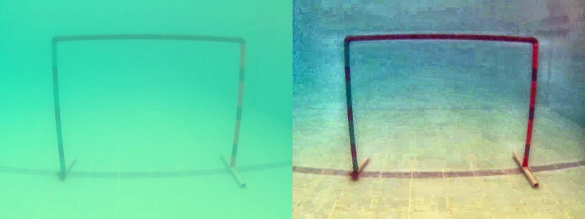
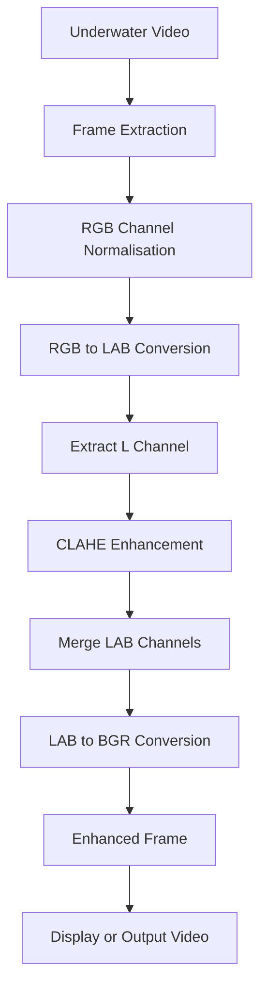
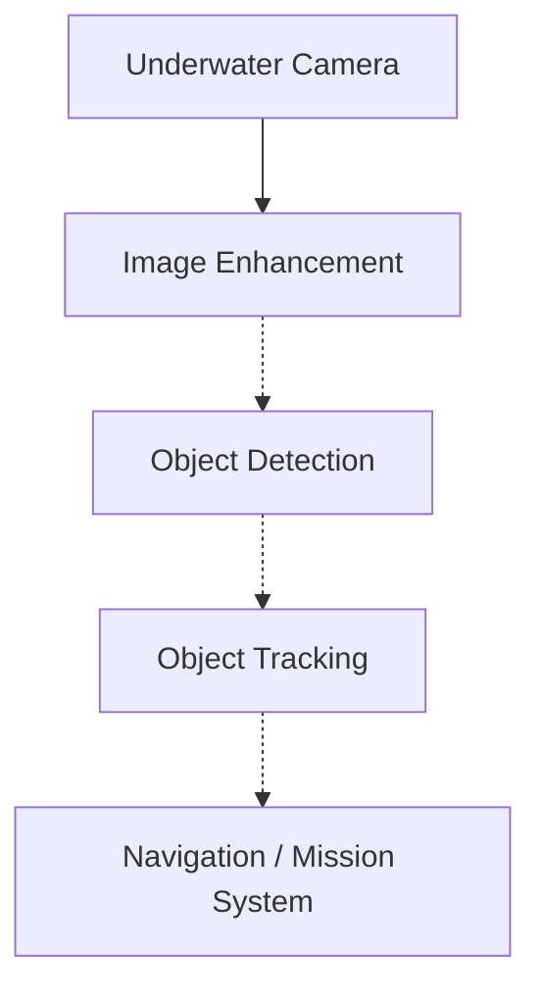
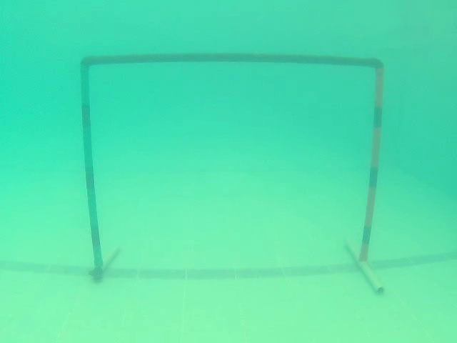
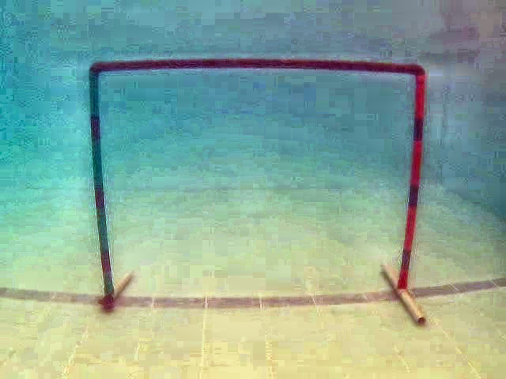

# Underwater Image Enhancement Pipeline for AUV Vision

A lightweight OpenCV pipeline that improves the visual quality of raw
underwater footage frame-by-frame. It is intended as a **preprocessing
stage** placed in front of downstream perception tasks (object detection,
tracking, visual odometry) on an Autonomous Underwater Vehicle.

<p align="center">
  
  <br/>
  <em>Frame 272 of <code>orig_foot.mp4</code>. Left: original. Right: enhanced.</em>
</p>

---

## Overview

Underwater imagery straight out of the camera is rarely usable for a
perception stack. Even in clear water, red wavelengths attenuate within a
few metres, contrast collapses, and forward scatter softens every edge.

This project applies a classical, real-time-friendly enhancement pipeline
built entirely on OpenCV primitives:

1. Per-channel min-max **normalisation** to counter partial colour cast.
2. Conversion to **CIE L\*a\*b\*** to separate brightness from colour.
3. **CLAHE** (Contrast Limited Adaptive Histogram Equalisation) applied
   only to the L (luminance) channel.
4. Reconstruction back to BGR for display or writing.

The pipeline is deliberately not learning-based, so it runs comfortably on
an embedded companion computer and adds negligible latency to the
perception loop.

## Problem Statement

Compared to imaging in air, underwater imaging suffers from:

- **Wavelength-dependent attenuation** — red is lost within a few metres,
  producing a green/blue cast that becomes stronger with depth.
- **Reduced visibility and forward scatter** — suspended particulates
  soften edges and lower effective contrast.
- **Uneven illumination** — surface caustics and directional light from
  the AUV itself create bright hotspots next to deep shadow.
- **Low contrast in the midtones** — histograms tend to bunch up, which
  starves downstream detectors and feature descriptors of information.

A perception pipeline that ingests the raw feed will inherit all of these
problems. Enhancing the frame first is the cheapest way to make the rest
of the stack work better.

## Approach

For every frame of the input video:

1. **Frame acquisition** – read the next BGR frame from the video source.
2. **RGB normalisation** – convert to RGB and stretch each channel to
   the full 0–255 range with `cv2.NORM_MINMAX`. This lifts the darker
   parts of the histogram and partially compensates for the colour cast.
3. **RGB → LAB conversion** – switch to the CIE L\*a\*b\* space so that
   perceptual brightness (L) is decoupled from chromaticity (a, b).
4. **Luminance extraction** – split the L channel out for contrast work.
5. **CLAHE enhancement** – equalise the L channel adaptively using
   `cv2.createCLAHE(clipLimit=2.0, tileGridSize=(10, 50))`. Working on
   tiles prevents a single bright/dark region from washing out the
   whole frame; the clip limit stops noise from being amplified too
   aggressively.
6. **LAB reconstruction** – merge the equalised L back with the original
   a and b channels.
7. **Enhanced frame output** – convert LAB → BGR for display or writing.

**Why L\*a\*b\* and not RGB or HSV?** Equalising RGB channels directly
shifts hues, because R/G/B carry both colour and brightness. In L\*a\*b\*
those are separate, so brightening L leaves the colour untouched.

**Why CLAHE and not global equalisation?** Underwater lighting is never
uniform, and a global histogram transform blows out one region while
leaving the other muddy. CLAHE equalises small tiles independently and
clips the histogram before redistribution, which keeps noise bounded.

## Architecture / Processing Pipeline

Frame-level flow inside this repository:



Where this module sits within a broader AUV perception stack (the
downstream modules are **conceptual integration points** and are **not
implemented in this repository**):



## Repository Structure

```text
AUV-task-main/
├── src/
│   ├── enhancement.py       # Pure per-frame enhancement function
│   └── video_processor.py   # CLI entry point that processes a video
├── results/
│   ├── original_frame.png   # Sample frame straight from orig_foot.mp4
│   ├── enhanced_frame.png   # Same frame after enhancement
│   └── comparison.png       # Side-by-side (original | enhanced)
├── docs/
│   └── pipeline.md          # Deeper notes on the algorithm choices
├── orig_foot.mp4            # Reference underwater clip used in demos
├── requirements.txt
├── .gitignore
└── README.md
```

## Installation

```bash
git clone <your-fork-url>.git
cd AUV-task-main
python -m venv .venv
# Windows: .venv\Scripts\activate
# Linux / macOS: source .venv/bin/activate
pip install -r requirements.txt
```

Python 3.9+ is recommended.

## Usage

Preview the enhanced video in a window (press **q** to quit):

```bash
python src/video_processor.py --input orig_foot.mp4
```

Write the enhanced video to disk without opening a window:

```bash
python src/video_processor.py --input orig_foot.mp4 --output results/enhanced.mp4 --no-display
```

Tune the CLAHE strength:

```bash
python src/video_processor.py --input orig_foot.mp4 --clip-limit 3.0 --tile-grid 8 8
```

Full CLI:

| Flag             | Type       | Default    | Purpose                                                |
| ---------------- | ---------- | ---------- | ------------------------------------------------------ |
| `--input, -i`    | path       | *required* | Input video file.                                      |
| `--output, -o`   | path       | `None`     | Optional path to write the enhanced video.             |
| `--clip-limit`   | float      | `2.0`      | CLAHE clip limit.                                      |
| `--tile-grid`    | `W H` ints | `10 50`    | CLAHE tile grid size.                                  |
| `--no-display`   | flag       | off        | Disable the preview window (headless mode).            |

You can also import the enhancement function directly:

```python
import cv2
from src.enhancement import enhance_frame

frame = cv2.imread("path/to/frame.png")
enhanced = enhance_frame(frame, clip_limit=2.0, tile_grid_size=(10, 50))
cv2.imwrite("enhanced.png", enhanced)
```

## Results

The samples below were generated from `orig_foot.mp4` (frame 272) using the
default parameters. Regenerate them at any time with:

```bash
python src/video_processor.py --input orig_foot.mp4 --output results/enhanced.mp4 --no-display
```

| Original                                    | Enhanced                                     |
| ------------------------------------------- | -------------------------------------------- |
|      |       |

Side by side:


