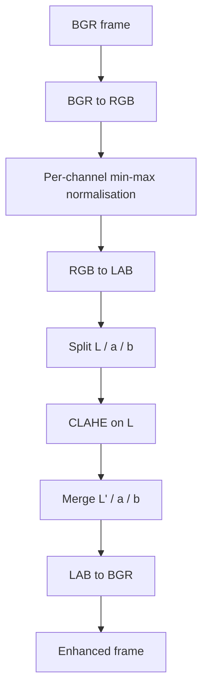

# Pipeline Notes

This document expands on the design choices made in `src/enhancement.py`.

## Why LAB and not HSV or plain RGB?

Applying histogram equalisation directly to the three RGB channels shifts
hues, because R/G/B carry both colour and brightness information. The CIE
L\*a\*b\* space decouples them:

- **L** – perceptual lightness (0 = black, 100 = white).
- **a** – green ↔ red chromaticity.
- **b** – blue ↔ yellow chromaticity.

By running CLAHE on **L only** we boost local contrast without disturbing
the colour cast that the earlier per-channel min-max stretch has already
partially corrected.

## Why CLAHE and not global histogram equalisation?

Underwater scenes are almost never uniformly lit: dappled surface caustics
sit next to deep shadows under rocks. A single global histogram
transformation blows out one region while leaving the other muddy. CLAHE
splits the frame into tiles (`tileGridSize`), equalises each tile, and
clips the histogram at `clipLimit` before redistribution — so a
disproportionately dark or bright patch cannot dominate the transform.

## Default parameters

| Parameter        | Default   | Meaning                                                      |
| ---------------- | --------- | ------------------------------------------------------------ |
| `clip_limit`     | `2.0`     | Higher = stronger local contrast, more amplified noise.      |
| `tile_grid_size` | `(10,50)` | Coarser tiles = smoother look; finer tiles = more locality.  |

The 10×50 grid is anisotropic on purpose — the reference footage is wider
than it is tall and the extra vertical tiles help handle the top-to-bottom
brightness gradient created by descending light.

## Pipeline diagram

